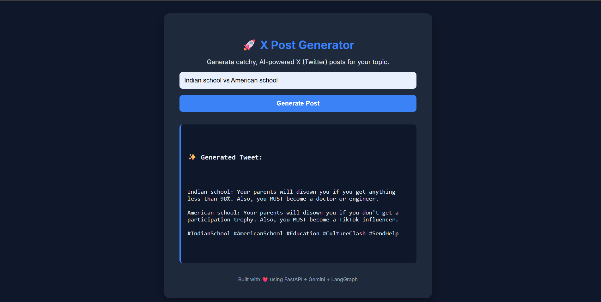

# 🚀 X Post Generator

Generate catchy, AI-powered X (Twitter) posts from any topic using **FastAPI**, **Gemini API**, and **LangGraph**.

---

## 🌟 Features

- AI generates short, viral-ready tweets
- Tweets are evaluated for humor, originality, and format
- Tweets are optimized automatically based on feedback
- Full workflow with multiple iterations for best results
- Modern, responsive web UI using **FastAPI + Jinja2**
- Dark theme with accent colors for better UX

---

## 🛠️ Tech Stack

- **Backend:** FastAPI  
- **Frontend:** HTML, CSS (Jinja2 templates)  
- **AI:** Google Gemini API (`langchain_google_genai`)  
- **Workflow Engine:** LangGraph  
- **Environment:** Python 3.10, Conda  

---

## ⚡ Installation

1. Clone the repo:

```bash
git clone https://github.com/omprakash-jangid/x_post_generator.git
cd x_post_generator
conda create -n x_post_generator python=3.10
conda activate x_post_generator
pip install fastapi uvicorn jinja2 python-multipart python-dotenv langchain-core langchain-google-genai langgraph
uvicorn app.main:app --reload
```


✨ How It Works

- Enter a topic in the UI
- AI generates a tweet using Gemini
- The tweet is evaluated for humor, virality, and format
- If needed, AI optimizes the tweet automatically
- Final tweet, feedback, and iteration count are displayed

## 🖥️ Screenshots


📂 Project Structure

```
x_post_generator_app/
├── app/
│   ├── main.py          # FastAPI app
│   ├── templates/
│   │   └── index.html   # UI
│   └── core/
│       └── generator.py # Tweet workflow with LangGraph
├── .env                 # API credentials
├── README.md
└── requirements.txt
```

📝 Notes

- Max 280 characters per tweet
- Avoids question-answer or setup-punchline style
- Can run multiple iterations to improve tweet quality

💡 Future Improvements

- Add tweet history in the UI
- Loading spinner during AI processing
- Option to download tweet as text or PDF


